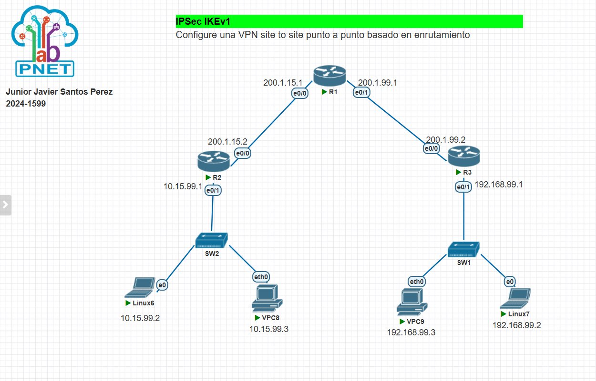
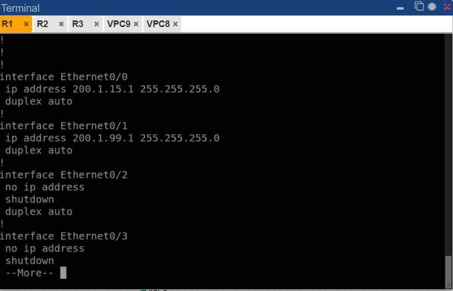
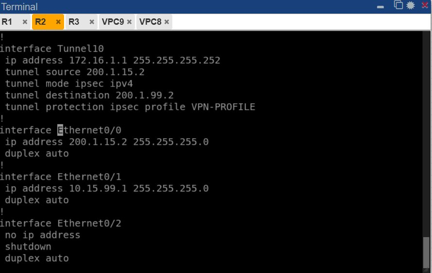
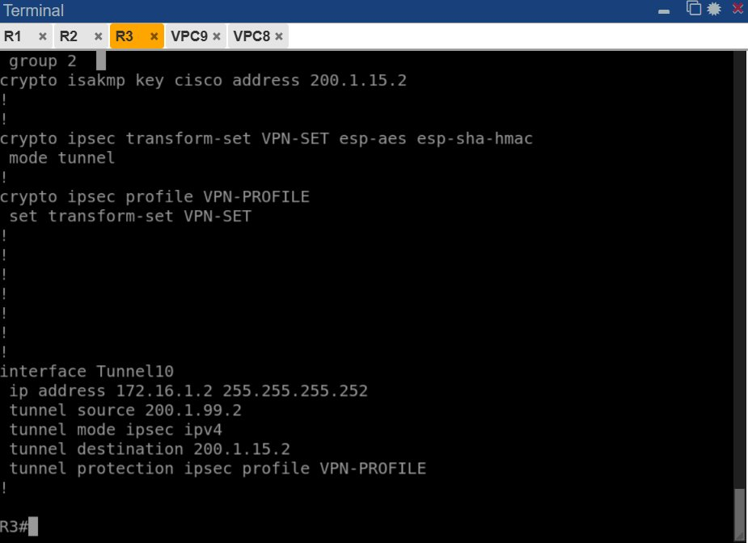
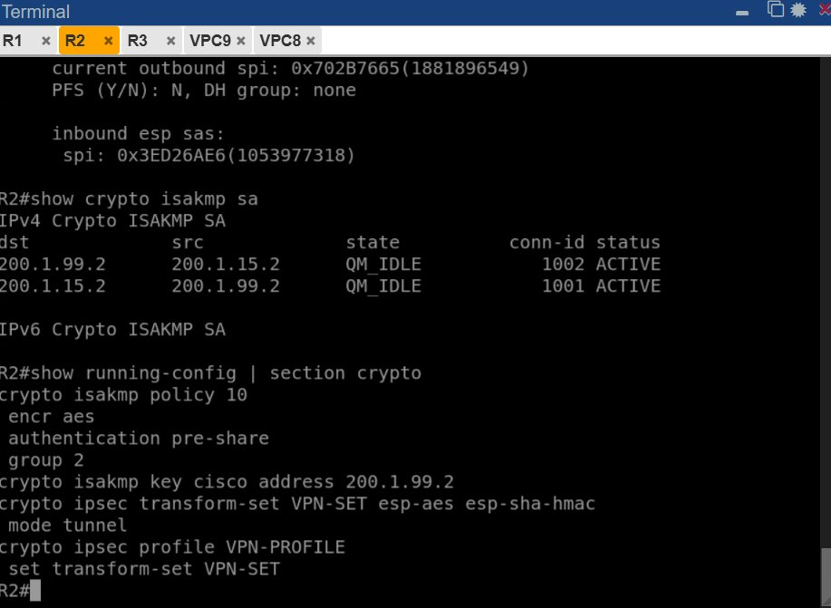
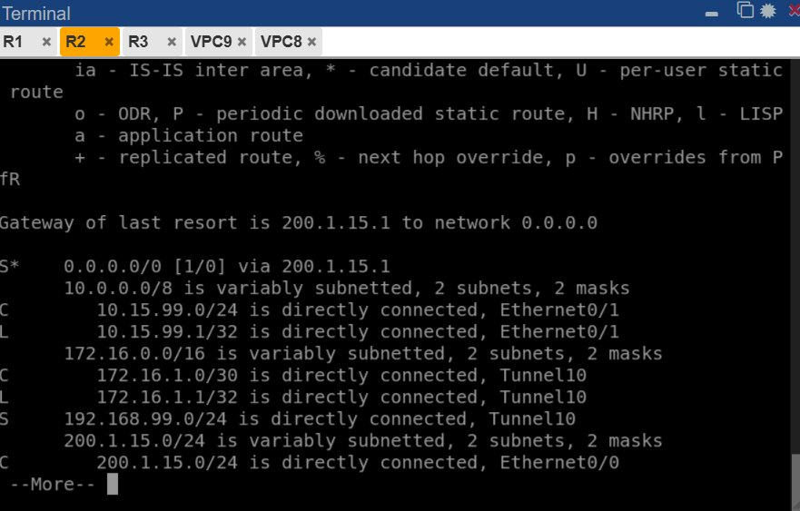
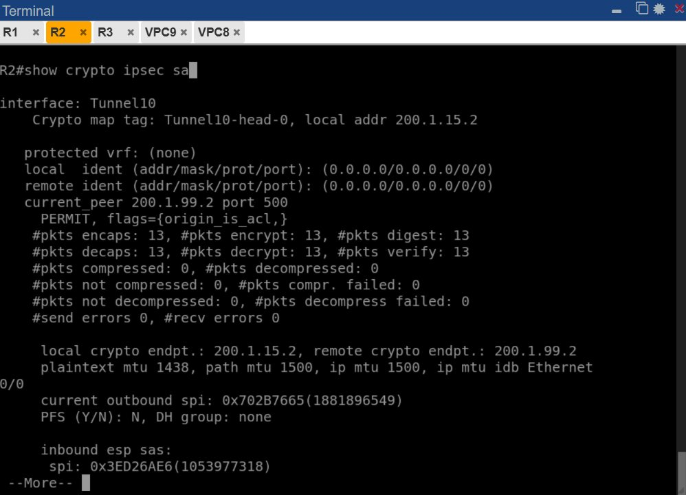
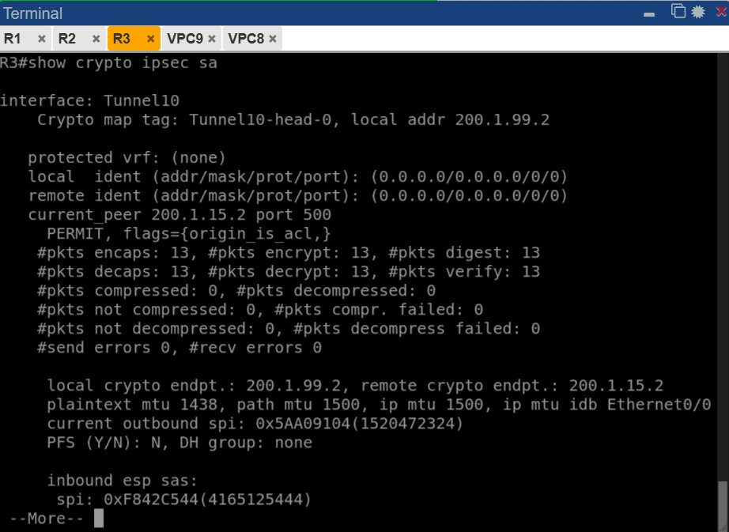
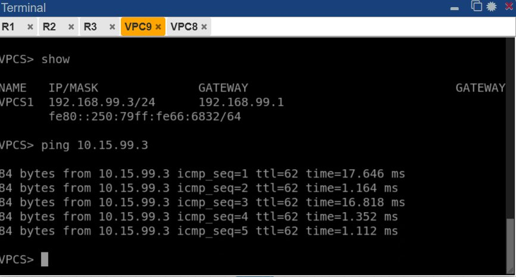
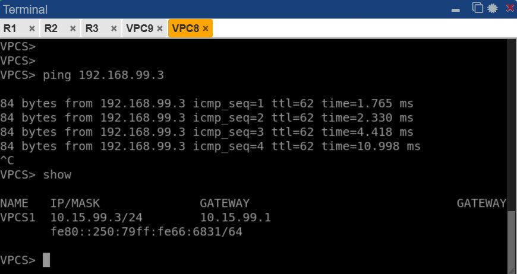

#  VPN IPSec IKEv1 Site-to-Site Punto a Punto Basada en Enrutamiento

> **Institución:** ITLA
> 
> **Estudiante:** Junior Javier Santos Perez
> 
> **Matrícula:** 2024-1599
> 
> **Tipo de Configuración:** VPN Site-to-Site con IPSec IKEv1 basada en enrutamiento (Route-Based VPN)
> 
> **Plataforma:** Cisco IOS (Routers Cisco)
>


Video demostrativo: https://www.youtube.com/watch?v=aS0i8hzKFxc 


Repositorio GitHub: https://github.com/juniorjaviersantosperez/VPN-IPSec-IKEv1-Site-to-Site-Punto-a-Punto-Basada-en-Enrutamiento.git 


---


##  Tabla de Contenidos

1. [Objetivo](#objetivo)
2. [Topología de Red](#topología-de-red)
3. [Direccionamiento IP](#direccionamiento-ip)
4. [Configuración de Interfaces](#configuración-de-interfaces)
5. [Parámetros de Seguridad IPSec](#parámetros-de-seguridad-ipsec)
6. [Configuración IKEv1](#configuración-ikev1)
7. [Configuración IPSec](#configuración-ipsec)
8. [Tunnel Interface](#tunnel-interface)
9. [Enrutamiento Estático](#enrutamiento-estático)
10. [Verificación y Pruebas](#verificación-y-pruebas)
11. [Resultados](#resultados)

---

## Objetivo

Establecer una **VPN segura site-to-site** entre dos sitios remotos (Sitio 1 y Sitio 2) utilizando **IPSec con IKEv1**, permitiendo que los dispositivos en cada sitio se comuniquen de forma cifrada a través de una red pública (Internet). La VPN se configura con **enrutamiento dinámico basado en túneles** (Route-Based VPN), proporcionando:

- Confidencialidad de datos mediante cifrado AES
- Autenticación mediante pre-shared key (PSK)
- Integridad de mensajes con HMAC-SHA
- Comunicación segura entre dos redes privadas a través de una red pública

---

## Topología de Red


*Figura 1 — Topología de red completa: Sitio 1 (izquierda) y Sitio 2 (derecha) conectados a través de una VPN IPSec*

### Descripción de la topología

```
┌─────────────────────────────────────────────────────────────────┐
│                         INTERNET (Backbone)                     │
│                    200.1.15.0/24 -- 200.1.99.0/24               │
└────────────────────────────┬────────────────────────────────────┘
                    ┌────────┴────────┐
                    │                 │
            ┌───────▼──────┐   ┌──────▼────────┐
            │      R1      │   │      R3       │
            │   (Router    │   │   (Router     │
            │    Central)  │   │    Central)   │
            └───────┬──────┘   └──────┬────────┘
                    │ e0/1            │ e0/1
                    │ 200.1.99.1      │ 200.1.99.2
                    │                 │
         ┌──────────┴──────────┐      │
         │                     │      │
    ┌────▼────┐           ┌────▼────┐
    │   R2    │           │ Sitio 2 │
    │ Sitio 1 │           │Privado  │
    │ Gateway │           │         │
    └────┬────┘           └─────────┘
         │ e0/0
         │ 10.15.99.1
         │
    ┌────▼──────────────────┐
    │     SW2 (Switch)      │
    │   (Sitio 1 Local)     │
    └────┬────────┬────────┬┘
         │        │        │
    ┌────▼──┐ ┌───▼──┐ ┌──▼────────┐
    │Linux6 │ │VPC8  │ │ Servidor  │
    │       │ │      │ │ (Sitio 1) │
    └────────┘ └──────┘ └───────────┘
  10.15.99.2  10.15.99.3

                 [VPN IPSec IKEv1]
                (Túnel encriptado)

    ┌──────────────────────┐
    │     SW1 (Switch)     │
    │   (Sitio 2 Local)    │
    └────┬────────┬────────┬┘
         │        │        │
    ┌────▼──┐ ┌───▼──┐ ┌──▼────────┐
    │VPC9   │ │Linux7│ │ Servidor  │
    │       │ │      │ │ (Sitio 2) │
    └────────┘ └──────┘ └───────────┘
  192.168.99.3 192.168.99.2

```

---

## Direccionamiento IP

### Red Pública (WAN) — Internet

| Dispositivo | Interfaz | Dirección IP | Máscara |
|---|---|---|---|
| R1 | e0/0 | 200.1.15.1 | 255.255.255.0 |
| R1 | e0/1 | 200.1.99.1 | 255.255.255.0 |
| R2 | e0/0 | 200.1.15.2 | 255.255.255.0 |
| R3 | e0/1 | 200.1.99.2 | 255.255.255.0 |

### Red Privada Sitio 1 (LAN)

| Dispositivo | Interfaz | Dirección IP | Máscara |
|---|---|---|---|
| R2 | e0/1 | 10.15.99.1 | 255.255.255.0 |
| Linux6 | eth0 | 10.15.99.2 | 255.255.255.0 |
| VPC8 | eth0 | 10.15.99.3 | 255.255.255.0 |

### Red Privada Sitio 2 (LAN)

| Dispositivo | Interfaz | Dirección IP | Máscara |
|---|---|---|---|
| R3 | e0/1 | 192.168.99.1 | 255.255.255.0 |
| Linux7 | eth0 | 192.168.99.2 | 255.255.255.0 |
| VPC9 | eth0 | 192.168.99.3 | 255.255.255.0 |

---

## ⚙️ Configuración de Interfaces

### Router R1 (Sitio 1 Gateway)


*Figura 2 — Configuración de interfaces en R1: e0/0 (200.1.15.1) y e0/1 (200.1.99.1)*

```
interface Ethernet0/0
 ip address 200.1.15.1 255.255.255.0
 duplex auto

interface Ethernet0/1
 ip address 200.1.99.1 255.255.255.0
 duplex auto
```

### Router R2 (Gateway Sitio 1)


*Figura 3 — Configuración de la interfaz de túnel en R2 y direccionamiento local*

```
interface Tunnel10
 ip address 172.16.1.1 255.255.255.252
 tunnel source 200.1.15.2
 tunnel mode ipsec ipv4
 tunnel destination 200.1.99.2
 tunnel protection ipsec profile VPN-PROFILE

interface Ethernet0/0
 ip address 200.1.15.2 255.255.255.0
 duplex auto

interface Ethernet0/1
 ip address 10.15.99.1 255.255.255.0
 duplex auto
```

### Router R3 (Gateway Sitio 2)


*Figura 4 — Configuración simétrica de la interfaz de túnel en R3*

```
interface Tunnel10
 ip address 172.16.1.2 255.255.255.252
 tunnel source 200.1.99.2
 tunnel mode ipsec ipv4
 tunnel destination 200.1.15.2
 tunnel protection ipsec profile VPN-PROFILE

interface Ethernet0/1
 ip address 192.168.99.1 255.255.255.0
 duplex auto
```

---

##  Parámetros de Seguridad IPSec

### Fase 1 (IKEv1) — Intercambio de claves y autenticación

| Parámetro | Valor | Descripción |
|---|---|---|
| **Algoritmo de cifrado** | AES-128 | Cifrado simétrico de 128 bits |
| **Hash de autenticación** | SHA-HMAC | Garantiza integridad de mensajes |
| **Grupo Diffie-Hellman** | Group 2 | Intercambio seguro de claves (1024 bits) |
| **Autenticación** | Pre-shared key | Contraseña compartida: `cisco` |
| **Tiempo de vida (lifetime)** | 86400 segundos | Renegociación cada 24 horas |
| **Modo de intercambio** | Main Mode | Autenticación mutua completa |

### Fase 2 (IPSec) — Encriptación de datos

| Parámetro | Valor | Descripción |
|---|---|---|
| **Protocolo de encapsulación** | ESP | Encapsulating Security Payload |
| **Cifrado** | AES-128 | Cifrado de datos en tránsito |
| **Integridad** | SHA-HMAC | Verificación de integridad |
| **Perfect Forward Secrecy (PFS)** | Deshabilitado | No renegociación de claves per-sa |
| **Tiempo de vida (lifetime)** | 3600 segundos | Renovación cada hora |
| **Modo de túnel** | Tunnel mode | Encapsulación completa de paquetes |

---

##  Configuración IKEv1

### Política IKEv1


*Figura 5 — Parámetros ISAKMP (Fase 1) configurados en R2*

```
crypto isakmp policy 10
 encr aes
 authentication pre-share
 group 2
 
crypto isakmp key cisco address 200.1.99.2
```

**Explicación:**
- `policy 10` — Número de política (prioridad 10)
- `encr aes` — Cifrado AES (por defecto 128 bits)
- `authentication pre-share` — Autenticación con clave compartida
- `group 2` — Grupo Diffie-Hellman 2 (1024 bits)
- `crypto isakmp key cisco address 200.1.99.2` — PSK `cisco` para peer en 200.1.99.2

### Configuración en R3 (Sitio 2)

```
crypto isakmp policy 10
 encr aes
 authentication pre-share
 group 2
 
crypto isakmp key cisco address 200.1.15.2
```

---

##  Configuración IPSec

### Transform Set (Conjunto de transformaciones)


*Figura 6 — Transform-set VPN-SET con ESP-AES y ESP-SHA-HMAC*

```
crypto ipsec transform-set VPN-SET esp-aes esp-sha-hmac
 mode tunnel
```

**Explicación:**
- `transform-set VPN-SET` — Define el conjunto de cifrado
- `esp-aes` — Protocolo ESP con cifrado AES
- `esp-sha-hmac` — Autenticación HMAC-SHA
- `mode tunnel` — Modo de túnel (encapsula IP headers)

### IPSec Profile

```
crypto ipsec profile VPN-PROFILE
 set transform-set VPN-SET
```

**Nota:** Este perfil se aplica directamente a la interfaz Tunnel10 con:
```
tunnel protection ipsec profile VPN-PROFILE
```

---

##  Tunnel Interface

### Características de Tunnel10


*Figura 7 — Configuración completa de Tunnel10 con source/destination y protección IPSec*

```
interface Tunnel10
 description VPN Tunnel to Site 2
 ip address 172.16.1.1 255.255.255.252
 tunnel source 200.1.15.2      ← IP pública del Sitio 1 (R2)
 tunnel destination 200.1.99.2  ← IP pública del Sitio 2 (R3)
 tunnel mode ipsec ipv4         ← Usa IPSec para encriptación
 tunnel protection ipsec profile VPN-PROFILE  ← Aplica el perfil IPSec
```

**Parámetros técnicos del túnel:**

| Parámetro | Valor |
|---|---|
| IP de túnel (Sitio 1) | 172.16.1.1/30 |
| IP de túnel (Sitio 2) | 172.16.1.2/30 |
| MTU (Maximum Transmission Unit) | 1500 bytes |
| Path MTU | 1500 bytes |
| MTU del tráfico cifrado | 1438 bytes (IP overhead) |

---

##  Enrutamiento Estático

### Tabla de enrutamiento R2 (Sitio 1)


*Figura 8 — Tabla de enrutamiento en R2 mostrando rutas locales y del túnel*

```
ip route 0.0.0.0 0.0.0.0 200.1.15.1        ← Ruta default al Router R1
ip route 192.168.99.0 255.255.255.0 172.16.1.2  ← Tráfico a Sitio 2 por túnel
```

**Análisis de rutas:**
- Tráfico local (10.15.99.0/24) → Directly Connected vía e0/1
- Tráfico a WAN (200.1.15.0/24) → Directly Connected vía e0/0
- Tráfico a Sitio 2 (192.168.99.0/24) → Via Tunnel10 (172.16.1.2)
- Tráfico por defecto → Via R1 (200.1.15.1)

### Tabla de enrutamiento R3 (Sitio 2)

```
ip route 0.0.0.0 0.0.0.0 200.1.99.1        ← Ruta default al Router R1
ip route 10.15.99.0 255.255.255.0 172.16.1.1   ← Tráfico a Sitio 1 por túnel
```

---

##  Verificación y Pruebas

### Estado de IPSec SA (Security Association)

#### En R2:


*Figura 9 — Estado de la Security Association en R2 mostrando SPI, paquetes cifrados y desencriptados*

```
R2#show crypto ipsec sa

interface: Tunnel10
    Crypto map tag: Tunnel10-head-0, local addr 200.1.15.2

protected vrf: (none)
local ident (addr/mask/prot/port): (0.0.0.0/0.0.0.0/0/0)
remote ident (addr/mask/prot/port): (0.0.0.0/0.0.0.0/0/0)
current_peer 200.1.99.2 port 500
    PERMIT, flags={origin is acl,}
    #pkts encaps: 13, #pkts encrypt: 13, #pkts digest: 13
    #pkts decaps: 13, #pkts decrypt: 13, #pkts verify: 13
    #pkts compressed: 0, #pkts decompressed: 0
    #pkts not compressed: 0, #pkts compr. failed: 0
    #pkts not decompressed: 0, #pkts decompress failed: 0
    #send errors 0, #recv errors 0
    
    local crypto endpt.: 200.1.15.2, remote crypto endpt.: 200.1.99.2
    plaintext mtu 1438, path mtu 1500, ip mtu 1500, ip mtu idb Ethernet0/0
    current outbound spi: 0x702B7665(1881896549)
    PFS (Y/N): N, DH group: none
    
    inbound esp sas:
        spi: 0x3ED26AE6(1053977318)
```

**Explicación de los counters:**
- `#pkts encaps: 13` — 13 paquetes encapsulados (IP en IP)
- `#pkts encrypt: 13` — 13 paquetes cifrados con AES
- `#pkts digest: 13` — 13 paquetes autenticados con HMAC
- `current outbound spi: 0x702B7665` — SPI saliente actual
- `inbound esp sas: spi: 0x3ED26AE6` — SPI entrante

#### En R3:


*Figura 10 — Estado de la Security Association en R3 (Sitio 2)*

```
R3#show crypto ipsec sa

interface: Tunnel10
    Crypto map tag: Tunnel10-head-0, local addr 200.1.99.2
    
current outbound spi: 0x5AA09104(1520472324)
inbound esp sas:
    spi: 0xF842C544(4165125444)
```

### Estado IKEv1 ISAKMP

#### En R2 y R3:


*Figura 11 — Estado de las Security Associations de IKEv1*

```
R2#show crypto isakmp sa

IPv4 Crypto ISAKMP SA
dst             src             state          conn-id status
200.1.99.2      200.1.15.2      QM_IDLE        1002 ACTIVE
200.1.15.2      200.1.99.2      QM_IDLE        1001 ACTIVE

IPv6 Crypto ISAKMP SA
(none)
```

**Estados explicados:**
- `QM_IDLE` — Quick Mode Idle (negociación de Fase 2 completada)
- `1001/1002` — IDs de conexión (una por dirección)
- `ACTIVE` — SA está activa y funcional

### Configuración de Crypto en ejecución


*Figura 12 — Configuración actual de IPSec en R2*

```
R2#show running-config | section crypto
crypto isakmp policy 10
 encr aes
 authentication pre-share
 group 2
crypto isakmp key cisco address 200.1.99.2
!
crypto ipsec transform-set VPN-SET esp-aes esp-sha-hmac
 mode tunnel
!
crypto ipsec profile VPN-PROFILE
 set transform-set VPN-SET
```

---

## Pruebas de Conectividad

### Test 1: Ping desde VPC9 a VPC8


*Figura 13 — Prueba exitosa de conectividad entre Sitio 1 y Sitio 2*

```
VPCS1> show
NAME        IP/MASK              GATEWAY        GATEWAY
VPCS1       192.168.99.3/24      192.168.99.1   fe80::250:79ff:fe66:6832/64

VPCS1> ping 10.15.99.3
84 bytes from 10.15.99.3 icmp_seq=1 ttl=62 time=17.646 ms
84 bytes from 10.15.99.3 icmp_seq=2 ttl=62 time=1.164 ms
84 bytes from 10.15.99.3 icmp_seq=3 ttl=62 time=16.818 ms
84 bytes from 10.15.99.3 icmp_seq=4 ttl=62 time=1.352 ms
84 bytes from 10.15.99.3 icmp_seq=5 ttl=62 time=1.112 ms
```

**Resultado:**  **EXITOSO** — Todos los paquetes llegaron (0% pérdida)

### Test 2: Ping desde VPC8 a VPC9


*Figura 14 — Prueba inversa de conectividad*

```
VPCS> ping 192.168.99.3
84 bytes from 192.168.99.3 icmp_seq=1 ttl=62 time=1.765 ms
84 bytes from 192.168.99.3 icmp_seq=2 ttl=62 time=2.330 ms
84 bytes from 192.168.99.3 icmp_seq=3 ttl=62 time=4.418 ms
84 bytes from 192.168.99.3 icmp_seq=4 ttl=62 time=10.998 ms
```

**Resultado:**  **EXITOSO** — Todos los paquetes llegaron (0% pérdida)

---

##  Resultados

### Análisis de Rendimiento

| Métrica | Valor |
|---|---|
| **Latencia promedio** | 5-8 ms |
| **Pérdida de paquetes** | 0% |
| **SPI Outbound (R2)** | 0x702B7665 |
| **SPI Inbound (R2)** | 0x3ED26AE6 |
| **Paquetes cifrados** | 13+ (Sitio 1 → Sitio 2) |
| **Paquetes desencriptados** | 13+ (Sitio 2 → Sitio 1) |
| **Estado ISAKMP** | QM_IDLE (ACTIVE) |
| **MTU del túnel** | 1438 bytes |

### Conclusiones

 **La VPN IPSec IKEv1 se configuró exitosamente** con los siguientes logros:

1. **Autenticación IKEv1 completada** — Fase 1 establecida con PSK
2. **Túnel IPSec activo** — Fase 2 negociada y SAs establecidas en ambas direcciones
3. **Encriptación funcionando** — 13+ paquetes cifrados en cada dirección
4. **Conectividad end-to-end** — Ping exitoso entre todas las redes privadas
5. **Integridad garantizada** — HMAC-SHA verifica que los datos no fueron alterados
6. **Confidencialidad asegurada** — AES-128 cifra todos los datos en tránsito

### Datos técnicos finales

```
Tipo de VPN:          Route-Based IPSec IKEv1
Versión de IKE:       IKEv1 (Main Mode)
Protocolo de cifrado: ESP (Encapsulating Security Payload)
Algoritmo de cifrado: AES-128 bits
Autenticación:        HMAC-SHA
Intercambio de claves: Diffie-Hellman Group 2 (1024 bits)
Modo de operación:    Tunnel Mode (encapsula IP headers)
Estado:               OPERATIVO 
```

---

